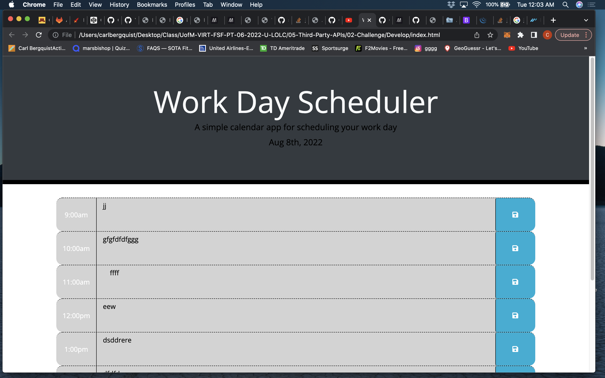

# Weekly-Planner

## Contributors

Carl Bergquist

## About Project

With this project we had to implement the localstorage api and use it to store and retreive are data. Along with that we made use of the bootstrap api and jqueary to aid us in the app working properly. On top of that we were also given a .css file that gave us some preset styling options for the save button and row to match the mockup photo. Moment.js was also key in getting the final project complete.

## Screenshot

## Website Url

[Weekly Planner Link](https://carlbergquist.github.io/Weekly-Planner/)
